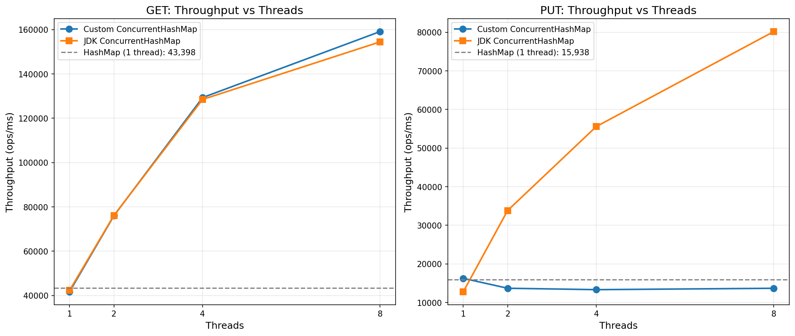

# Реализация ConcurrentHashMap

### Цель работы

Реализовать thread-safe хеш-таблицу с закрытой адресацией (separate chaining).

### Требования

- Операции: `put`, `get`, `size`, `clear`, `merge`, итератор
- (Почти) никогда не блокирующие операции чтения
- Однозначный наблюдаемый порядок между завершёнными операциями

## Архитектура

### Структура данных

```
                ConcurrentHashMap                                                                     
  volatile Node<K,V>[] table     (бакеты)          
  Segment[16] segments           (сегментные локи) 
  LongAdder[16] counters         (счётчики)        
  ReentrantLock lock             (глобальный лок)  
```

Каждый бакет - это односвязный список узлов (`Node`), содержащих `hash`, `key`, `volatile value` и `next`.

### Модель конкурентности: Segment Locking

Таблица разделена на 16 **сегментов**. Каждый сегмент защищает группу бакетов своим `ReentrantLock`:

```
Segment 0:  buckets 0, 16, 32, ...
Segment 1:  buckets 1, 17, 33, ...
...
Segment 15: buckets 15, 31, 47, ...
```

Сегмент определяется как `hash & (segments.length - 1)`. Поскольку `table.length` всегда >= `segments.length` (обе -
степени двойки), все бакеты одного сегмента гарантированно защищены одним локом.

**Следствие:** до 16 потоков могут одновременно писать в разные сегменты без блокировки друг друга.

### Неблокирующее чтение

`get()` **не захватывает никаких локов**. Корректность обеспечивается:

| Механизм                         | Что защищает                                        |
|----------------------------------|-----------------------------------------------------|
| `volatile Node<K,V>[] table`     | Видимость новой таблицы после resize                |
| `VarHandle.getAcquire()` (tabAt) | Атомарное чтение головы бакета с acquire-семантикой |
| `volatile V value` в Node        | Видимость обновлённого значения без лока            |

Таким образом, `get()` - wait-free операция (не ждёт ни одного лока).

### Атомарные операции над массивом

Прямой доступ к элементам `Node[]` не гарантирует видимость между потоками. Поэтому вместо `table[i]` используется
`VarHandle`:

```java
// Чтение с acquire-семантикой (аналог volatile read)
NODE_ARRAY_HANDLE.getAcquire(table, i)

// Запись с release-семантикой (аналог volatile write)
NODE_ARRAY_HANDLE.

setRelease(table, i, node)

// Compare-And-Swap
NODE_ARRAY_HANDLE.

compareAndSet(table, i, expected, update)
```

### Подсчёт размера: LongAdder

Вместо одного `AtomicLong` используется массив из 16 `LongAdder` (по одному на сегмент). Каждый `put`/`merge`
инкрементирует счётчик своего сегмента. `size()` суммирует все счётчики.

`LongAdder` внутри распределяет записи по нескольким ячейкам (striping), что устраняет contention при конкурентных
инкрементах.

### Resize (динамическое расширение)

При `size() >= table.length * 0.75` запускается resize:

1. Захватывается глобальный `ReentrantLock`
2. Повторная проверка - если другой поток уже расширил, выход
3. Захватываются все 16 сегментных локов - полная остановка записей
4. Создаётся новый массив двойного размера
5. Каждый узел перехешируется в новый бакет (`hash & (newCapacity - 1)`)
6. `table = newTable` (volatile write - мгновенно видно для `get()`)
7. Освобождаются все локи

## Реализованные операции

| Операция                | Описание                                       | Блокировка     |
|-------------------------|------------------------------------------------|----------------|
| `get(key)`              | Поиск по ключу                                 | Без локов      |
| `put(key, value)`       | Вставка/обновление                             | Сегментный лок |
| `merge(key, value, fn)` | Если ключ есть - `fn(old, new)`, иначе вставка | Сегментный лок |
| `size()`                | Сумма всех LongAdder                           | Без локов      |
| `clear()`               | Очистка таблицы                                | Сегментный лок |
| Итератор                | Обход пар ключ-значение                        | Без локов      |

## Тестирование

### Concurrency-тесты (jcstress)

Файл: `ConcurrentMapTest.java`

Тесты с `@JCStressTest` для проверки модели памяти:

- Видимость записи из `put` в `get` на другом потоке
- Атомарность `merge` при конкурентном доступе

## Бенчмарки

Файл: `BenchmarkMultiThread.java`. Карта предзаполнена 1 000 000 записей с Integer-ключами. Операции — случайный get/put по существующим ключам. HashMap измерен строго в 1 потоке (не thread-safe).

### HashMap baseline (1 поток)

| Benchmark | Throughput (ops/ms) | Error |
|---|---:|---:|
| getHashMap | 43 398 | ± 641 |
| putHashMap | 15 938 | ± 8 092 |

### GET: масштабирование по потокам

| Threads | Custom (ops/ms) | JDK (ops/ms) |
|---:|---:|---:|
| 1 | 41 684 | 42 287 |
| 2 | 75 977 | 76 113 |
| 4 | 129 317 | 128 480 |
| 8 | 159 093 | 154 446 |

### PUT: масштабирование по потокам

| Threads | Custom (ops/ms) | JDK (ops/ms) |
|---:|---:|---:|
| 1 | 16 262 | 12 775 |
| 2 | 13 690 | 33 829 |
| 4 | 13 327 | 55 580 |
| 8 | 13 682 | 80 164 |

### Графики



### Анализ результатов

**GET масштабируется линейно у обеих реализаций.** Обе реализации используют lock-free чтение: Custom — через `VarHandle.getAcquire()`, JDK — через `volatile`-чтение. На x86-64 acquire-семантика компилируется в обычный `mov` без memory fence, поэтому overhead от thread-safety при чтении равен нулю. Throughput Custom и JDK практически идентичен и близок к HashMap baseline, что подтверждает отсутствие накладных расходов на синхронизацию при чтении.

**PUT Custom не масштабируется (16K ops/ms при любом числе потоков).** Причина — грубая гранулярность блокировок: 16 сегментов на всю таблицу. При 8 потоках вероятность коллизии на одном сегменте ~84%, что приводит к постоянному contention на `ReentrantLock`. Кроме того, даже при отсутствии contention каждый lock/unlock — это CAS-операция, вызывающая cache-line bouncing между ядрами.

**PUT JDK масштабируется линейно (12K -> 80K).** JDK ConcurrentHashMap (Java 8+) использует lock-per-bucket: `synchronized` на первой ноде бакета. Это даёт ~1M независимых "локов" вместо 16, практически исключая contention. Для пустых бакетов JDK использует CAS без блокировки вовсе. Lightweight locking в JVM (biased locking, thin locks) минимизирует overhead в uncontended случае.

**Custom быстрее JDK при 1 потоке на put (16K vs 12K).** В однопоточном режиме `ReentrantLock` без contention дешевле, чем более сложная логика JDK CHM (CAS + fallback на `synchronized` + TreeBin поддержка). Преимущество исчезает при добавлении потоков, где fine-grained подход JDK выигрывает.
