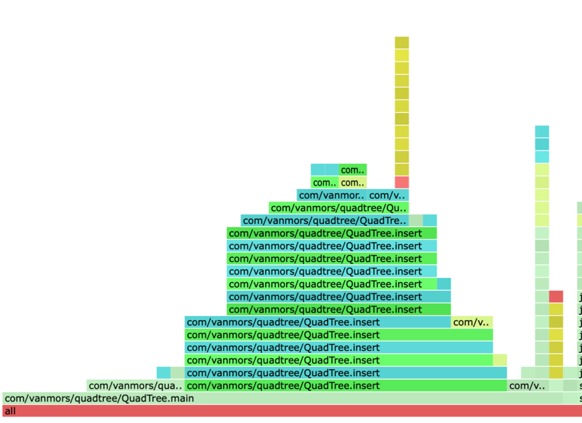

# Лабораторная работа №2

## Цель:  
Необходимо реализовать геопоиск по Lat/Lng на карте.  
Что должна уметь система:  
1) Помещать географически расположенные объекты
2) Искать объекты по не точным координатам

## Выполнение:  
В качестве алгоритма для реализации был выбран `QuadTree`.  
И реализованы методы:
1) insert вставка координаты в дерево
2) queryRadius - определение ближайших точек по радиусу
3) queryRange - определение ближайших точек по прямоугольнику

Вставка (insert)  
Алгоритм рекурсивно спускается по дереву, выбирая подходящий квадрант для новой точки. При переполнении листа происходит разделение узла (subdivide), после чего точки перераспределяются между четырьмя дочерними узлами.

Поиск по радиусу (queryRadius)  
Так как QuadTree работает с прямоугольными областями, поиск по радиусу выполняется в два этапа:
Строится приближённый ограничивающий прямоугольник (bounding box), полностью покрывающий искомый круг.
Выполняется queryRange для этого прямоугольника.
Из полученных кандидатов отбираются только те точки, расстояние до которых (по формуле Haversine) не превышает заданный радиус.

### Результаты производительности
Для оценки эффективности QuadTree были проведены бенчмарки с использованием JMH.
Также для сравнения был реализован альтернативный подход — Geohash + TreeMap.

Размер БД, Geohash + TreeMap (ops/us), QuadTree (ops/us), Geohash быстрее в  
1 000, "4,368", "0,084", 52 раза  
10 000, "3,980", "0,013", 306 раз  
50 000, "3,746", "0,002", 1 873 раза  
100 000, "3,391", "0,002", 1 695 раза  

Размер БД,Geohash + TreeMap (us/op),QuadTree (us/op)  
1 000, "0,231", "11,430"  
10 000, "0,227", "75,363"  
50 000, "0,267", "450,202"  
100 000, "0,298", "535,926"

### CPU

### Вывод по производительности:  
1) Geohash + TreeMap значительно превосходит QuadTree по скорости поиска, особенно при росте объёма данных.
2) QuadTree показывает приемлемую производительность только при небольшом количестве объектов (до 5–10 тысяч). При дальнейшем увеличении БД наблюдается существенная деградация времени отклика.